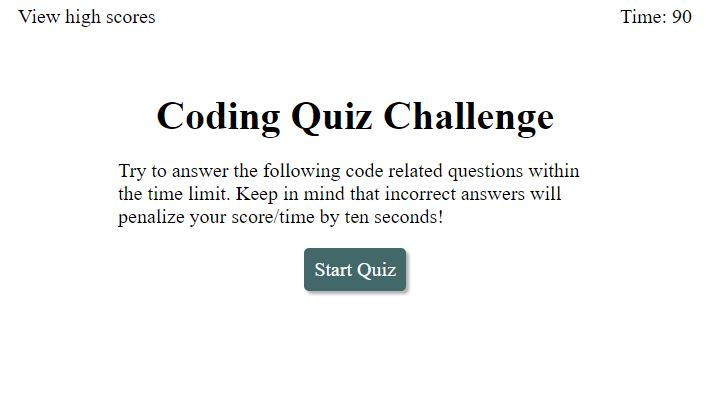

# shotgunCodeQuiz

## Description

shotgunCodeQuiz is an application that runs a timed coding quiz with multiple-choice questions. The app runs in the browser, and features dynamically updated HTML and CSS powered by JavaScript code. It has a clean, polished, and responsive user interface meant to give the user options for starting, stopping, submitting scores, and viewing historical scores. A 90 second clock counts down the moment the user begins answering questions. They have the option to complete the quiz or end early and view high scores. Make sure to intial and save your score when it's over!

### DOM manipulation in Javascript:

- Operators
- Control flow
- Objects
- Arrays
- Functions

## Table of Contents (Optional)

- [Installation](#installation)
- [Usage](#usage)
- [Badges](#badges)
- [How_to_Contribute](#how_to_contribute)
- [Credits](#credits)
- [License](#license)

## Installation

No installation needed.

## Usage

The website can be found at: https://arishorts.github.io/shotgunCodeQuiz/

User has 90 seconds to answer 5 multiple choice questions. Every wrong answer deducts 10 seconds from the quiz 

## Badges

 
 

## How_to_Contribute

If you would like to contribute, refer to the [Contributor Covenant](https://www.contributor-covenant.org/)

## Credits

- Mosh Hamedani: https://github.com/mosh-hamedani
- Contact Me Page: https://codewithmosh.com/
- CodeExplained (Youtube): https://www.youtube.com/watch?v=49pYIMygIcU&ab_channel=CodeExplained
- TheNetNinja (Youtube): https://www.youtube.com/watch?v=Nx2AhrCIlXE&ab_channel=TheNetNinja
- BrianDesign (Youtube): https://www.youtube.com/watch?v=f4fB9Xg2JEY&t=2506s&ab_channel=BrianDesign

## License

MIT License https://choosealicense.com/licenses/mit/

---

© 2022 Ariel Schwartz LLC. Confidential and Proprietary. All Rights Reserved.
